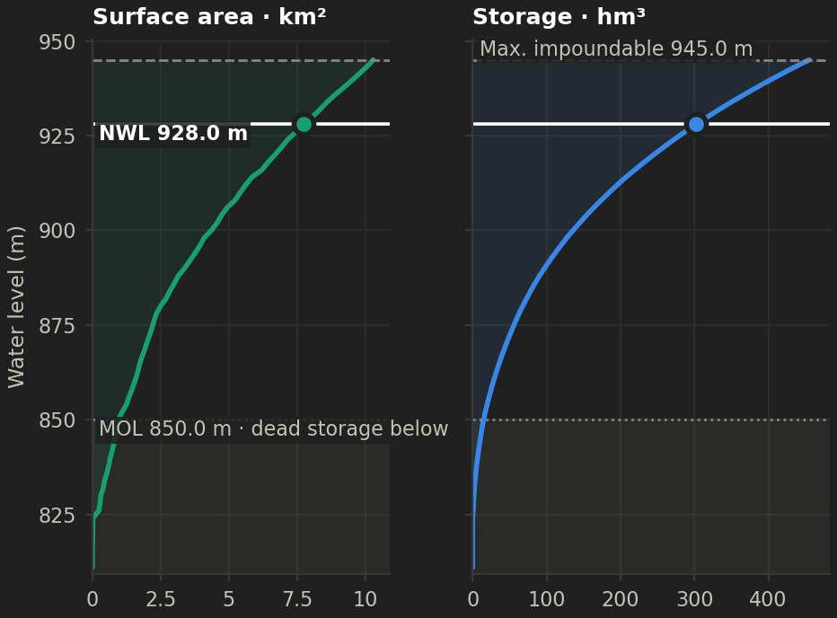
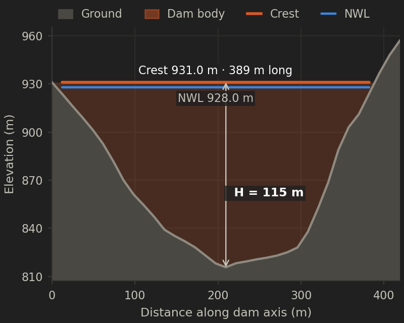
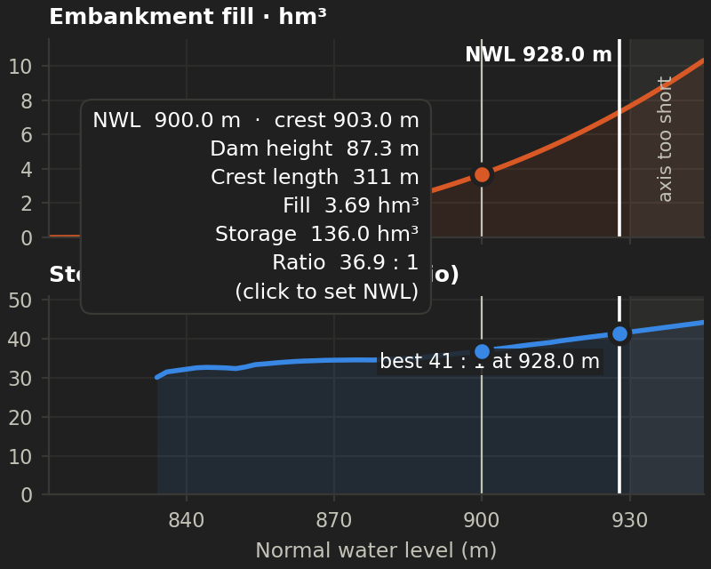

Reservoir Creator for QGIS
==========================

Draw a dam axis across a valley and see the reservoir it would create: the
**elevation–area–capacity** relationship, the flooded area at any water level,
the **maximum level the site can hold**, and the key numbers for dam planning.
It only needs a DEM, which the plugin can download for you.

Works with **QGIS 3.34 LTR up to QGIS 4.x** (Qt5 and Qt6).


Features
--------

* **Draw the dam axis on the map** (as in the Profile Tool) or use a line layer.
  Left-click to add vertices, right-click to finish, Backspace to undo, Esc to
  cancel. Project snapping is honoured.
* **Elevation data from a project layer, or downloaded** for the dam area only:
  * **GEDTM30**: a global *bare-earth* terrain model at 30 m (OpenGeoHub,
    CC-BY 4.0). Recommended. The download link is looked up in the
    [Zenodo record](https://zenodo.org/records/18887460) each time, so new
    versions are picked up automatically.
  * **Copernicus GLO-30**: a global *surface* model at 30 m.
  * Only the window around the dam is read (Cloud-Optimised GeoTIFF), so a
    study downloads megabytes, not the global dataset. Downloads are cached.
* **No contour layer needed.** The reservoir is computed directly from the DEM
  (see *Method* below).
* **Maximum impoundable level.** The plugin reports the level at which water
  would escape. It says why: water goes around the left or right end of the
  axis, over a saddle (marked on the map), or reaches the edge of the DEM.
* **Automatic upstream side** and **automatic metric CRS**. Any DEM CRS works,
  including geographic ones, which are reprojected to the local UTM zone.
* **Interactive results in a dockable panel.** A water-level slider updates the
  numbers, the charts and the flood extent on the map as you drag it. Clicking
  any chart or table row sets the level.
* **Charts** (hover for values):
  * *Area–capacity*: surface area and storage against water level, with the
    normal water level (NWL), the minimum operating level (MOL) with the dead
    storage zone, and the maximum impoundable level.
  * *Dam axis*: ground profile along the axis with the dam body, crest, NWL and
    dam height.
  * *Dam sizing*: embankment fill and storage-to-fill ratio against the NWL.
    The best site efficiency is marked, and levels where the drawn axis is too
    short for the crest are greyed out.
* **Planning indicators** at the chosen level: surface area, gross, dead and
  live storage, mean and maximum depth, reservoir length, shoreline length and
  shoreline development index, crest level, dam height, crest length,
  indicative embankment fill, storage : fill ratio. With a mean inflow you
  also get the capacity/inflow ratio, residence time and Brune sediment trap
  efficiency.
* **Outputs**:
  * layers added to the map: reservoir outline, dam axis, water-depth raster
  * GeoPackage (outline, axis and the elevation–area–capacity table)
  * water-depth GeoTIFF
  * CSV table
  * PNG charts
  * copying the table to the clipboard

| Area–capacity | Dam axis | Dam sizing |
|---|---|---|
|  |  |  |

Quick start
-----------

1. Install the plugin: *Plugins › Manage and Install Plugins › Install from
   ZIP* (build the zip with `make zip`, or zip this folder as
   `reservoir_creator/`).
2. Click the **Reservoir Creator** toolbar button. The panel opens and the
   drawing tool is already active.
3. Under **Elevation data**, pick a DEM layer or choose **Download ›
   GEDTM30**.
4. Draw the dam axis from one abutment to the other and right-click to
   finish. With *Run automatically* ticked, the analysis starts straight away.
   Otherwise press **Run analysis**.
5. Drag the **water level** slider, explore the charts, then use **Add to
   map** or **Export**.

Sample data (`data/`): `dem_utm37.tif` (EPSG:32637) and `dam_line.shp`.
The DEM predates the dam, so the result can be compared with the real
reservoir:

| Computed reservoir at NWL 928 m (sample DEM, hillshade) | The actual reservoir |
|---|---|
|  |  |

Method
------

**Spill level by priority flood.** The dam axis is burnt into the DEM as an
impassable wall. Starting from the lowest cell just upstream of the dam, the
plugin floods the terrain with a priority queue: it always raises the water to
the lowest cell on the shoreline. The level at which each cell first joins
the reservoir is its *spill level* `s`. For any water level `h`:

    A(h) = a · #{cells with s ≤ h}
    V(h) = a · Σ_{s ≤ h} (h − z) = a · (h·n(h) − Σ_{s ≤ h} z)

Here `a` is the cell area and `z` the ground elevation. After one sort, the
whole curve and every "what if the level were h?" query are instant.

* Hollows that are *not connected* to the reservoir are never counted.
* The flood stops when water finds another way out. That level is the
  **maximum impoundable level**:
  * water reaches the downstream side of the dam (around an abutment or over
    a saddle), or
  * it reaches the edge of the analysis area, or
  * it reaches a DEM void.
* **Upstream side**: the plugin floods from both faces of the dam. The
  downstream face drains away along the river almost immediately; the
  upstream face has to fill up first. You can override the choice with
  *Upstream side* or **Flip upstream**.
* **Water surface**: the outline is vectorised with GDAL contour
  polygonisation at the water level, giving smooth, sub-pixel shorelines
  rather than blocky pixel edges.
* **Reservoir length**: the longest path from the dam through the water body
  (8-connected geodesic distance), so winding valleys are measured correctly.
* **Dam figures** use the ground profile along the axis. The crest is
  `NWL + freeboard`. The trapezoidal embankment section is
  `A(H) = b·H + (m_us + m_ds)·H²/2`, integrated along the axis. This is a
  screening estimate: foundation excavation and cut-off works are not
  included.
* **Default NWL**: the lower of the maximum impoundable level and the ground
  at the axis ends, minus the freeboard.
* **Trap efficiency**: Brune median curve, Dendy (1974) form
  `TE = 100 · 0.97^(0.19^log10(C/I))`. Residence time is `V / Q̄`.

### Validation

`tests/test_core.py` checks the engine against the closed-form solution for a
tilted V-shaped valley `z = z0 + s|x| + g·y`:

* `A(D) = D²/(g·s)`
* `V(D) = D³/(3·g·s)`
* reservoir length `D/g`

Area and volume are within 3% at 10 m cells. The tests also cover bypass
around a short dam, exclusion of isolated depressions, and reprojection of
geographic DEMs. On the sample data the result (294.7 hm³ at 927 m) agrees
with an independent SciPy flood-fill check.

### Getting good results

* **Use a bare-earth DTM.** Surface models (DSMs, e.g. Copernicus GLO-30)
  include forest canopy and buildings. These raise the valley floor, so
  storage is underestimated.
* **Existing reservoirs**: a DEM acquired after impoundment shows the *water
  surface*, not the lake bed. Use a pre-impoundment DEM or bathymetry for
  existing lakes.
* **Resolution**: 30 m global DEMs have metre-level vertical errors. Treat
  small reservoirs (a few hm³) and the lowest few metres of any curve as
  indicative. For design work, use a local LiDAR or survey DTM.
* **Nodata**: if the DEM has no nodata value but contains many exact `0`
  cells (a common unflagged collar or sea mask), those cells are treated as
  nodata. The plugin tells you when it does this.
* **Analysis radius**: if the reservoir reaches the edge of the analysis
  window, the plugin says so. Increase the radius.
* **Units**: `hm³` = 10⁶ m³ = million cubic metres. Heights are in the DEM's
  vertical datum (EGM2008 for GEDTM30 and Copernicus).

Development
-----------

```
core/            pure numpy + GDAL engine (no QGIS imports; unit tested)
  hydro.py       priority flood, capacity table, dam and hydrology formulas
  terrain.py     DEM windows, reprojection, rasterising, water-surface polygons
  analysis.py    end-to-end analysis -> ReservoirModel
  dem_sources.py GEDTM30 (Zenodo look-up) and Copernicus GLO-30 downloads
gui/             QGIS/Qt user interface (Qt5 + Qt6 via qgis.PyQt)
  dock.py        the panel;  charts.py  matplotlib charts;  map_tools.py  drawing tool
  task.py        background QgsTask;  outputs.py  layers and exports
tests/           pytest suite + headless QGIS smoke test (tests/qgis_harness.py)
```

```
make test                      # engine unit tests (python with numpy + GDAL)
make smoke PYTHON=python3      # full plugin inside QGIS, offscreen; writes screenshots
make zip                       # build/reservoir_creator-<version>.zip
```

Data credits
------------

* **GEDTM30**: Ho, Y.-F., Grohmann, C.H., Lindsay, J., Reuter, H.I.,
  Parente, L., Witjes, M., Hengl, T. (2025). *GEDTM30: global ensemble
  digital terrain model at 30 m and derived multiscale terrain variables.*
  PeerJ 13:e19673. Data: <https://zenodo.org/records/18887460>, CC-BY 4.0.
* **Copernicus DEM GLO-30**: © DLR e.V. 2010–2014 and © Airbus Defence and
  Space GmbH 2014–2018, provided under COPERNICUS by the European Union and
  ESA.

License
-------

Copyright (C) 2021–2026 Faruk Gurbuz

This program is free software; you can redistribute it and/or modify it under
the terms of the GNU General Public License as published by the Free Software
Foundation; either version 3 of the License, or (at your option) any later
version. This program is distributed in the hope that it will be useful, but
WITHOUT ANY WARRANTY; without even the implied warranty of MERCHANTABILITY or
FITNESS FOR A PARTICULAR PURPOSE. See the GNU General Public License for more
details: <http://www.gnu.org/licenses/>.
