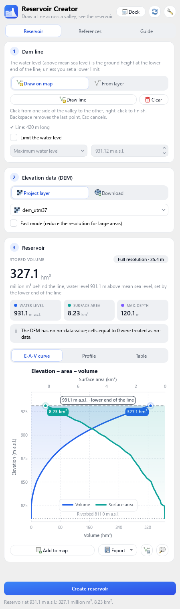
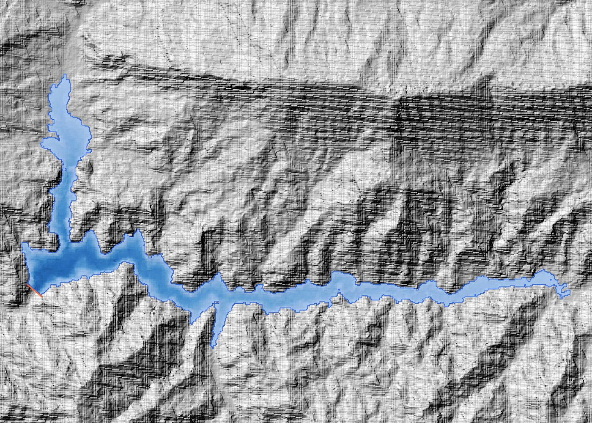

# Reservoir Creator for QGIS

Draw a line across a valley and see the reservoir behind it: stored volume,
water level, surface area, maximum depth and the elevation–area–volume curves,
computed from a DEM.

**📖 Documentation: <https://gurbuzf.github.io/reservoir_creator/>** ·
[Türkçe](https://gurbuzf.github.io/reservoir_creator/tr/)

<p align="center">
  
  &nbsp;
  
</p>

## Features

* Full DEM resolution; optional design limit (maximum water level or depth)
* Only water connected to the line is counted
* Your own DEM, or GEDTM30 / Copernicus GLO-30 downloaded in cached tiles
* Engineering elevation–area–volume chart, profile, table; GeoPackage, GeoTIFF,
  CSV and PNG exports
* QGIS 3.28 to 4.x (Qt5 and Qt6) · English and Turkish · light and dark

## Install

The plugin is not in the official QGIS plugin repository yet; install it from
GitHub:

1. **Download the ZIP**: green **Code** button ▸ **Download ZIP**
   ([direct link](https://github.com/gurbuzf/reservoir_creator/archive/refs/heads/master.zip)).
   Keep it zipped.
2. In QGIS: **Plugins ▸ Manage and Install Plugins ▸ Install from ZIP**, choose
   the file, **Install Plugin**, and confirm the security warning.
3. Make sure **Reservoir Creator** is ticked under **Installed**; its button
   appears in the toolbar.

To update, install the newest ZIP the same way.

## Quick start

1. Open the panel from the toolbar.
2. Draw a line across the valley (right-click to finish), or pick a line layer.
3. Choose a DEM layer, or **Download** GEDTM30.
4. Press **Create reservoir**.

Sample data (in the ZIP): `data/dem_utm37.tif` and `data/dam_line.shp` (≈ 328 hm³ at
931.2 m a.s.l.). See the [user guide](https://gurbuzf.github.io/reservoir_creator/guide.html)
and [how it works](https://gurbuzf.github.io/reservoir_creator/how-it-works.html).

## Development

```
make test     # unit tests (engine, translations)
make smoke    # whole plugin inside QGIS, offscreen
make zip      # installable package
```

## Credits

* **Method**: Faruk Gurbuz, Reservoir Creator 1.0 (2021). Version 2 finds the
  reservoir extent on the DEM instead of from contour lines, using the
  Priority-Flood technique (Barnes, Lehman & Mulla, 2014, *Computers &
  Geosciences* 62, 117–127).
* **Data**: GEDTM30, Ho et al. (2025), PeerJ 13:e19673, CC-BY 4.0 ·
  Copernicus DEM GLO-30 © DLR e.V. / Airbus, provided under COPERNICUS by the
  EU and ESA.
* **Development**: version 2 was developed and upgraded with the assistance of
  Claude Opus 5.5 (Anthropic), under the author's direction and review.

## License

© 2021–2026 Faruk Gurbuz · [GNU GPL v3](LICENSE)
