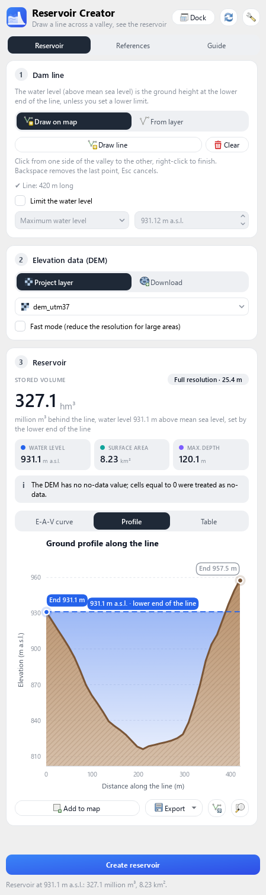
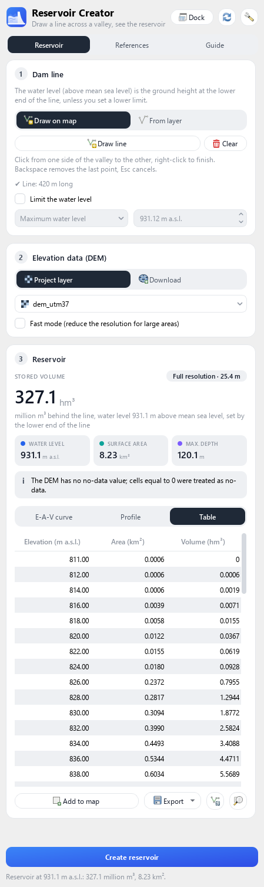
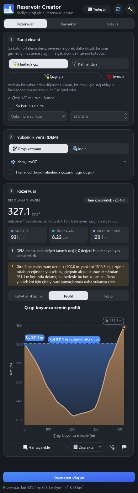
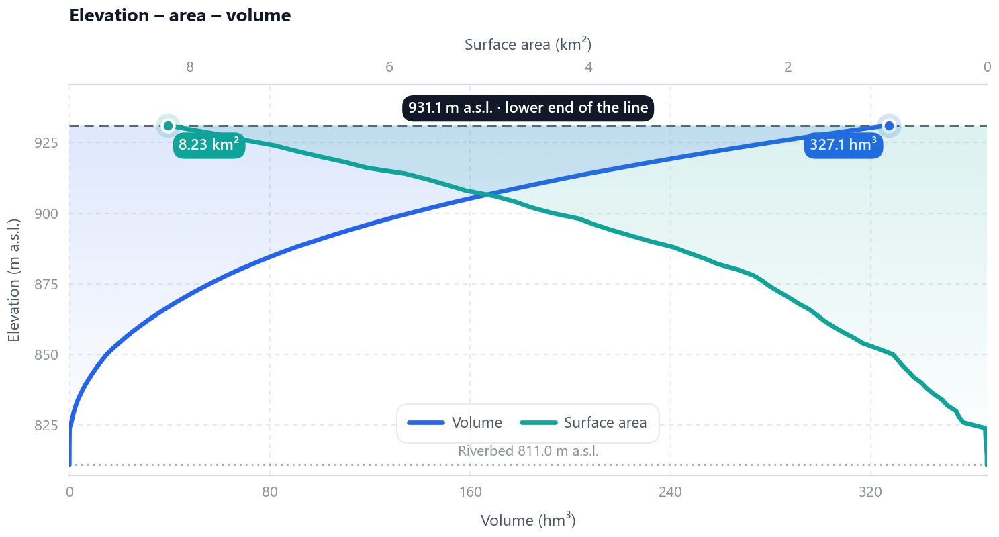
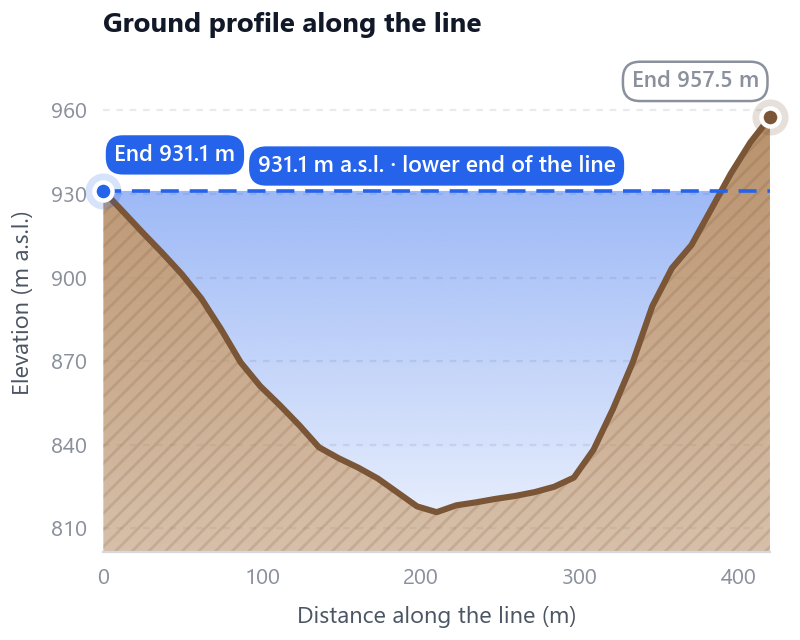
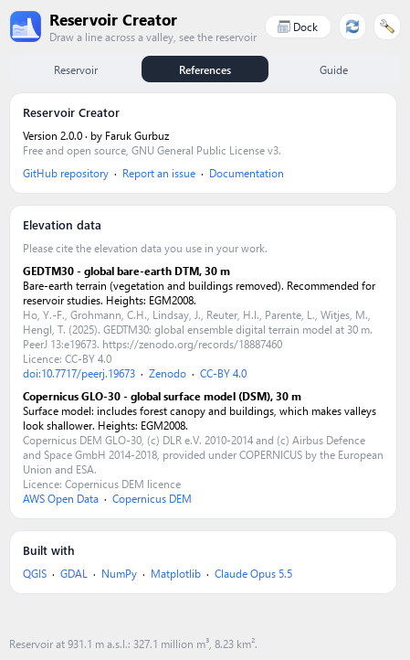
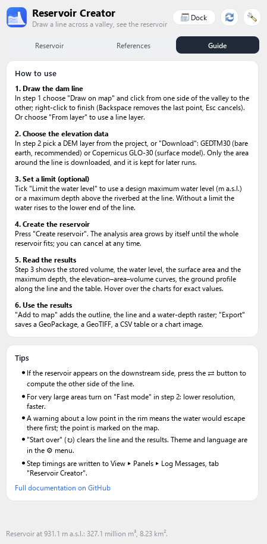
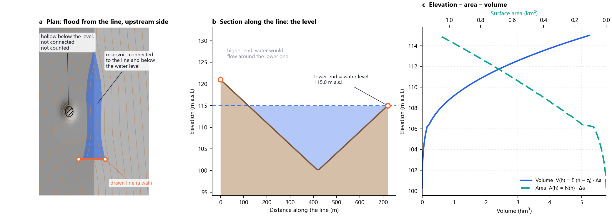

# Reservoir Creator for QGIS

Draw a line across a valley and see the reservoir behind it: **stored volume,
water level, surface area, maximum depth and the elevation–area–volume
curves**, computed from a digital elevation model (DEM).

* QGIS **3.34 LTR to 4.x** (Qt5 and Qt6), Windows, macOS and Linux
* Works with your own DEM, or downloads a global 30 m DEM for just the area the
  reservoir needs
* English and Turkish interface, light and dark theme

<p align="center">
  
  &nbsp;
  
</p>

---

## Contents

1. [Installation](#installation)
2. [Quick start](#quick-start)
3. [User guide](#user-guide)
4. [Computation methodology](#computation-methodology)
5. [Validation](#validation)
6. [Performance](#performance)
7. [Limitations and good practice](#limitations-and-good-practice)
8. [Troubleshooting](#troubleshooting)
9. [Development](#development)
10. [References](#references)
11. [License](#license)

---

## Installation

**From the QGIS plugin manager:** *Plugins ▸ Manage and Install Plugins*,
search for **Reservoir Creator** (enable *Show also experimental plugins* in
the settings tab while the plugin is experimental).

**From a ZIP:** download the repository as a ZIP (or build one with
`make zip`), then *Plugins ▸ Manage and Install Plugins ▸ Install from ZIP*.

**From source (for development):** clone the repository and link it into your
QGIS profile's plugin folder, e.g. on Windows

```
mklink /J "%APPDATA%\QGIS\QGIS3\profiles\default\python\plugins\reservoir_creator" C:\path\to\reservoir_creator
```

Requirements: numpy, GDAL and matplotlib, all bundled with QGIS on Windows
and macOS (on Linux install `python3-matplotlib` if it is missing).

## Quick start

1. Click the **Reservoir Creator** toolbar button. The panel opens in its own
   window (use **Dock** to attach it to QGIS) with the drawing tool active.
2. Click from one side of the valley to the other and **right-click** to
   finish.
3. Under **Elevation data**, choose a DEM layer, or **Download** GEDTM30.
4. Press **Create reservoir**.

Try it with the sample data in [`data/`](data): `dem_utm37.tif` and
`dam_line.shp` (EPSG:32637). With the sample line the reservoir is at
931.2 m a.s.l. and holds about 328 million m³ over 8.2 km².

## User guide

The panel has three pages: **Reservoir** (the analysis), **References**
(sources, links, licences) and **Guide** (a short version of this section).

### 1 · Dam line

* **Draw on map**: click points across the valley; right-click (or Enter)
  finishes, Backspace removes the last point, Esc cancels. The line can have
  several vertices.
* **From layer**: use the first line of a line layer, or tick *Use the
  selected feature*.
* The **water level** is the ground height at the **lower end of the line**,
  in metres above mean sea level (m a.s.l., the DEM's vertical datum). Above
  that level the water would simply flow around the end of the line.
* **Limit the water level** (optional), when the design maximum is below the
  crest (freeboard):
  * **Maximum water level** in m a.s.l., or
  * **Maximum depth** in m above the riverbed at the line.

  The water level is then the lower of your limit and the lower line end. A
  limit above what the line can hold is reported (message bar and panel) and
  the line's level is used.

### 2 · Elevation data (DEM)

* **Project layer**: any file-based raster in any CRS. It is used at its own
  resolution; geographic DEMs are reprojected to the local UTM zone.
* **Download** (only the area the reservoir needs, cached for later runs,
  cancellable at any time):
  * **GEDTM30**: global *bare-earth* terrain model, 30 m (OpenGeoHub,
    CC-BY 4.0). Recommended: vegetation and buildings are removed.
  * **Copernicus GLO-30**: global *surface* model, 30 m. Tree canopy and
    buildings make valleys look shallower, so volumes tend to be low.
  * *Add the downloaded DEM to the project* keeps the mosaic as a layer.
* **Fast mode** lowers the resolution of very large analysis areas for speed.
  It is off by default: results are computed at full DEM resolution unless you
  ask otherwise.

### 3 · Reservoir (results)

Nothing is computed until you press **Create reservoir**. Changing the line
clears the old result; changing the DEM or the options keeps it and asks for
a new run.

<p align="center">
  
  
  
</p>

* **Stored volume** (hm³ = million m³) with the **water level** (m a.s.l.),
  **surface area** (km²) and **maximum depth** (m).
* A chip shows the resolution the result was computed at; notes explain
  anything that limited the reservoir (a low point in the rim, the DEM edge,
  missing data, your limit).
* **E-A-V curve**: the elevation–area–volume chart in the usual engineering
  layout, elevation on the left, volume on the bottom axis and surface area on
  a reversed top axis, so the two curves cross. Hover for exact values.
* **Profile**: the ground along the line, both ends and the water level.
* **Table**: elevation, area and volume at regular steps.
* **Add to map**: the reservoir outline, the line and a water-depth raster, in
  a new layer group.
* **Export**: GeoPackage (outline, line, table), water depth (GeoTIFF), table
  (CSV or clipboard), chart image (PNG, always on a white background for
  reports).
* **⇄ (flip side)**: the upstream side is found automatically; if the
  reservoir ever appears on the downstream side, this computes the other side.
* **Zoom** to the reservoir.

| Elevation – area – volume (exported PNG) | Ground profile (exported PNG) |
|---|---|
|  |  |

### Other controls

* **Start over** (↻) clears the line and the results and re-arms drawing.
* **⚙** chooses the theme (Auto follows QGIS, Light, Dark) and the language
  (English, Türkçe).
* **Dock / Undock** attaches the panel to the QGIS window or shows it as a
  separate window; the choice and the window position are remembered.

<p align="center">
  
  &nbsp;
  
</p>

## Computation methodology



*Figure computed with the plugin's own engine on a synthetic valley that
rises upstream and has a closed hollow on its west slope.*

### 1. Working grid

The DEM is read over an analysis window around the line. Projected metric
DEMs are read on their own grid; other DEMs are warped (bilinear) to the local
UTM zone at their native resolution. Cells with no data are excluded; if a DEM
has no no-data value but many cells are exactly 0 (a common unflagged border),
those are treated as no-data. The window holds at most 30 million cells at full
resolution; beyond that the plugin asks for Fast mode instead of silently
coarsening.

### 2. The line as a wall, and the water level

The line is rasterised onto the grid and its cells become impassable. The
ground is sampled along it every half cell, giving the profile (panel b). With
end elevations *z*<sub>start</sub> and *z*<sub>end</sub>:

&nbsp;&nbsp;&nbsp;&nbsp;*h*<sub>line</sub> = min(*z*<sub>start</sub>, *z*<sub>end</sub>)

since above that level the water would flow around the lower end. With a
design limit the target level is

&nbsp;&nbsp;&nbsp;&nbsp;*h* = min(*h*<sub>line</sub>, *h*<sub>max</sub>) &nbsp; or &nbsp;
*h* = min(*h*<sub>line</sub>, *z*<sub>bed</sub> + *d*<sub>max</sub>)

where *z*<sub>bed</sub> is the lowest ground along the line (the riverbed at
the dam).

### 3. Which side is upstream

At the lowest point of the line the cells on each side are split by the
line's direction. A short, bounded flood is run from each side up to *h*. On
the downstream side the water leaves along the river almost at once, so the
water rises little; the side where the water rises more is the reservoir. The
choice is made once and kept for the rest of the run; ⇄ forces the other side.

### 4. Filling the reservoir: Priority-Flood

From the lowest cell next to the line on the upstream side, a
**Priority-Flood** (Barnes et al., 2014) visits cells in order of their
*spill level*: the lowest water level at which each cell becomes connected to
the reservoir,

&nbsp;&nbsp;&nbsp;&nbsp;*s*<sub>j</sub> = max(*z*<sub>j</sub>, *s*<sub>i</sub>) &nbsp; for a neighbour *j* reached from cell *i* (4-connected).

The flood never crosses the line and stops when:

* the next spill level exceeds *h* (normal case: the reservoir is complete);
* it reaches cells on the other side of the line: the water would bypass the
  line through a **low point in the rim**, so the level is lowered to that
  point, which is marked on the map;
* it reaches the edge of the analysis window: the window is enlarged (see 5);
* it reaches the edge of the DEM or missing data: the result is reported as
  cut there.

Because cells are reached only through connected water, hollows that lie
below *h* but are not connected to the reservoir are **not counted** (panel
a).

### 5. Growing the analysis window

The window starts at 20× the line length around the line (5–30 km). If the
water reaches one of its edges, **only that side** is doubled (up to 200 km per
side), so a long, narrow reservoir gets a long, narrow window. Downloaded DEMs
come in fixed 0.25° tiles kept in a local cache, so enlarging the window only
fetches the new tiles.

### 6. Elevation–area–volume

With the spill levels *s*<sub>i</sub> and ground *z*<sub>i</sub> of all
reservoir cells and the cell area Δ*a*, for any level *h*:

&nbsp;&nbsp;&nbsp;&nbsp;*N*(*h*) = number of cells with *s*<sub>i</sub> ≤ *h*<br>
&nbsp;&nbsp;&nbsp;&nbsp;*A*(*h*) = *N*(*h*) · Δ*a*<br>
&nbsp;&nbsp;&nbsp;&nbsp;*V*(*h*) = Σ<sub>*s*<sub>i</sub> ≤ *h*</sub> (*h* − *z*<sub>i</sub>) · Δ*a*

The cells are sorted once by spill level and cumulative sums of *z* are kept,
so the whole curve (panel c) is evaluated exactly, without re-flooding, at
about 120 round levels from the riverbed to *h*. The maximum depth is
*h* − min *z*<sub>i</sub>.

### 7. Shoreline and depth

The outline is traced with GDAL's contour polygoniser at level *h* on a copy of
the DEM in which every cell outside the reservoir is raised above *h*, giving a
smooth, sub-cell shoreline. The water-depth raster is *h* − *z* on reservoir
cells.

### 8. Downloads

GEDTM30 and Copernicus GLO-30 are Cloud-Optimised GeoTIFFs read over HTTP
with GDAL's `/vsicurl/`: only the blocks covering the needed tiles are
transferred, several at a time. GEDTM30's current Float32 release stores metres
(its internal 0.1 scale tag is ignored); older integer releases store
decimetres. Slow or interrupted transfers are retried; downloads can be
cancelled at any time and never leave partial files.

## Validation

**Exact solution.** For a V-shaped valley *z* = *z*<sub>0</sub> + *s*|*x*| +
*g*·*y*, the volume at depth *D* is *D*³ / (3 *g s*) and the area
*D*² / (*g s*). The unit tests check the plugin against both (within 3 %, and
within 5 % with a maximum-depth limit, where the riverbed falls between cell
centres).

**Sample dam** (`data/`, DEM made before the dam): the computed outline matches
the actual reservoir.

| Computed reservoir (sample DEM) | The actual reservoir (satellite) |
|---|---|
|  |  |

**Ilısu Dam (Tigris, Türkiye)**, GEDTM30 downloaded by the plugin, full
resolution (27.4 m cells, 18.1 million cells, the reservoir reaching more than
100 km up the valley), read from the curve at the normal water level:

| At 525 m a.s.l. | Reservoir Creator | Published |
|---|---|---|
| Surface area | 310.1 km² | 313 km² |
| Volume | 10 508 hm³ | 10 410 hm³ |

## Performance

The flood fill and the curves take seconds even for very large reservoirs;
what takes time is fetching the DEM. Ilısu: 129 s the first time (4 window
enlargements, 40 tiles downloaded), **11 s** for later runs from the tile
cache. Every run writes the time of each step to *View ▸ Panels ▸ Log
Messages*, tab **Reservoir Creator**.

## Limitations and good practice

* **Use a bare-earth DTM.** Surface models (DSM) include trees and buildings.
* **Existing lakes**: a DEM made after the lake filled shows the water
  surface, not the lake bed; use one made before impoundment.
* **Accuracy**: global 30 m DEMs have vertical errors of a few metres, which
  matter for shallow reservoirs. For design work use a local LiDAR or survey
  DTM.
* **Heights** are in the DEM's vertical datum (EGM2008 for both download
  sources); volumes are in hm³ = million m³.
* The line is treated as an impermeable wall from the ground up; embankment
  volume, sediment and evaporation are not modelled.

## Troubleshooting

* **Slow download**: the GEDTM30 server's speed varies; the status line shows
  progress and elapsed seconds. Try again later or use Copernicus.
* **"Reservoir continues beyond the analysis area"**: the full-resolution
  window would exceed 30 million cells; turn on Fast mode or use a DEM clipped
  to the valley.
* **Reservoir on the wrong side**: press ⇄.
* **Timings and details**: *Log Messages* panel, tab *Reservoir Creator*.
* **Bugs**: please open an [issue](https://github.com/gurbuzf/reservoir_creator/issues)
  with the QGIS version, the steps, and (after a crash) the stack trace from
  the QGIS crash dialog.

## Development

```
core/                 engine: numpy + GDAL, no Qt (unit tested)
  analysis.py         line -> water level -> reservoir, window growth, step timings
  hydro.py            Priority-Flood and the elevation-area-volume table
  terrain.py          DEM reading and reprojection, rasterising, shoreline
  dem_sources.py      GEDTM30 / Copernicus downloads and the tile cache
  i18n.py, i18n_tr.py interface language (English source, Turkish table)
gui/                  QGIS panel (Qt5 and Qt6 through qgis.PyQt)
  dock.py             the panel;  charts.py  matplotlib charts
  task.py             background task;  outputs.py  layers and exports
  widgets.py, theme.py  styling, light / dark
tests/
  test_core.py        engine and translation tests (pytest)
  qgis_harness.py     the whole plugin inside a real QGIS (offscreen)
```

```
make test     # unit tests
make smoke    # whole plugin in QGIS, offscreen
make zip      # build/reservoir_creator-<version>.zip
```

On Windows, run the same with QGIS's Python, e.g.
`python-qgis-ltr.bat -m pytest tests` and
`python-qgis-ltr.bat tests/qgis_harness.py build/smoke` with
`QT_QPA_PLATFORM=offscreen`.

**Translations**: every visible string goes through `tr()` (or `Msg()` for
text that is shown later); add the Turkish text to `core/i18n_tr.py`. A unit
test fails if a string has no translation or a translation changes the
`{}` placeholders.

## References

**Elevation data**

* **GEDTM30**: Ho, Y.-F., Grohmann, C.H., Lindsay, J., Reuter, H.I., Parente,
  L., Witjes, M., Hengl, T. (2025). *GEDTM30: global ensemble digital terrain
  model at 30 m and derived multiscale terrain variables.* PeerJ 13:e19673.
  [doi:10.7717/peerj.19673](https://doi.org/10.7717/peerj.19673),
  [Zenodo](https://zenodo.org/records/18887460), CC-BY 4.0.
* **Copernicus DEM GLO-30**: © DLR e.V. 2010–2014 and © Airbus Defence and
  Space GmbH 2014–2018, provided under COPERNICUS by the European Union and
  ESA. [AWS Open Data](https://registry.opendata.aws/copernicus-dem/).

**Method**

* Barnes, R., Lehman, C., Mulla, D. (2014). *Priority-Flood: An optimal
  depression-filling and watershed-labeling algorithm for digital elevation
  models.* Computers & Geosciences 62, 117–127.
  [doi:10.1016/j.cageo.2013.04.024](https://doi.org/10.1016/j.cageo.2013.04.024)

**Software**

* [QGIS](https://qgis.org), [GDAL](https://gdal.org),
  [NumPy](https://numpy.org), [Matplotlib](https://matplotlib.org).
* Version 2 of the plugin was developed and upgraded with the assistance of
  **Claude Opus 5.5** ([Anthropic](https://www.anthropic.com/claude)), an AI
  model used for coding, testing and documentation under the author's
  direction and review.

## License

Copyright (C) 2021–2026 Faruk Gurbuz

This program is free software; you can redistribute it and/or modify it under
the terms of the GNU General Public License as published by the Free Software
Foundation; either version 3 of the License, or (at your option) any later
version. This program is distributed in the hope that it will be useful, but
WITHOUT ANY WARRANTY; without even the implied warranty of MERCHANTABILITY or
FITNESS FOR A PARTICULAR PURPOSE. See the [LICENSE](LICENSE) file or
<https://www.gnu.org/licenses/>.
