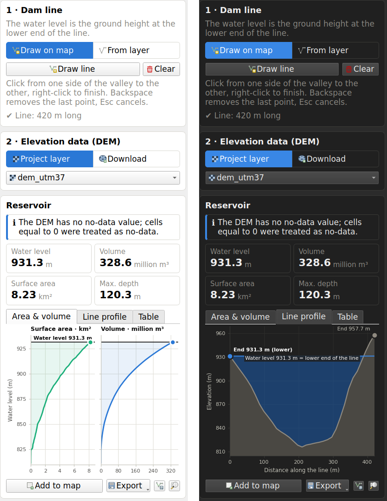
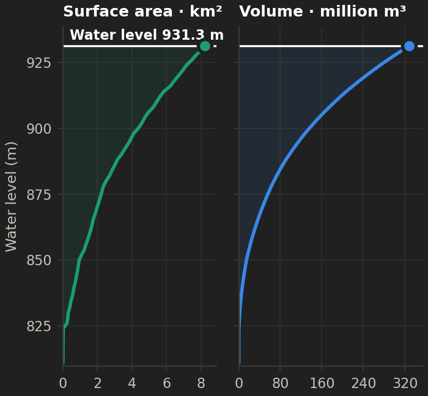
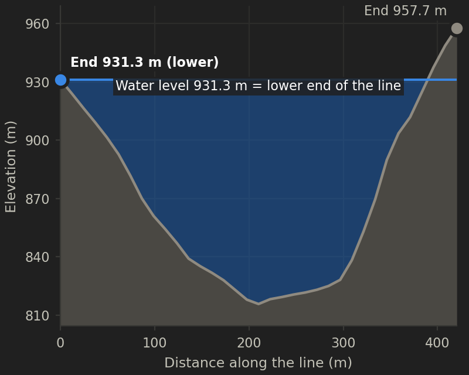
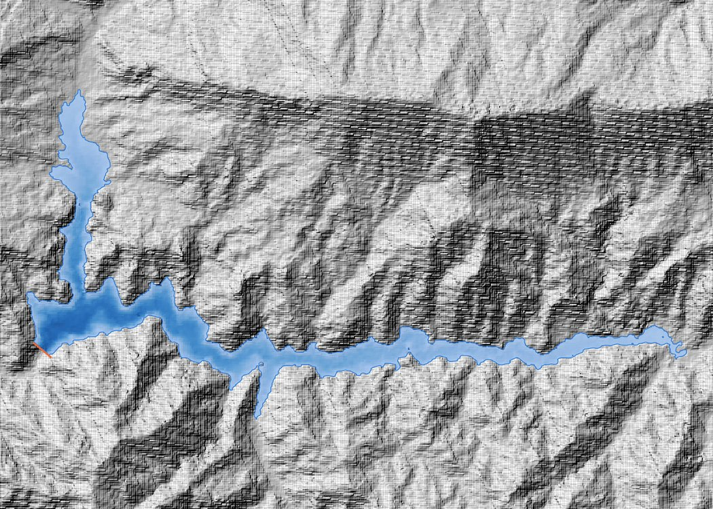
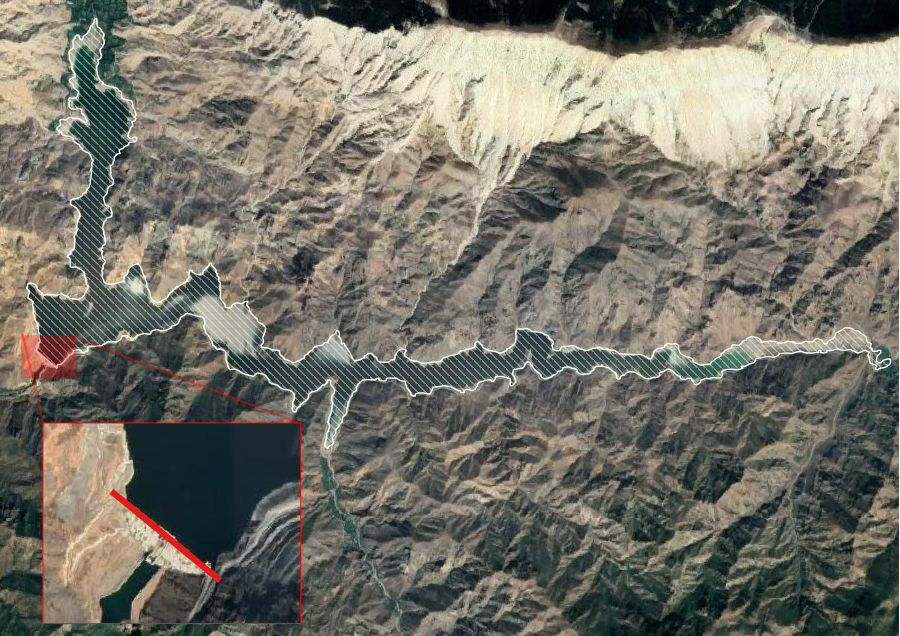

Reservoir Creator for QGIS
==========================

Draw a line across a valley and see the reservoir behind it. You get the
flooded area, the water volume and the elevation–area–volume curve, computed
from a DEM only.

Works with **QGIS 3.34 LTR up to QGIS 4.x** (Qt5 and Qt6).



How it works
------------

1. **Draw a line** across the valley, or pick a line layer. This is the dam.
2. **Water level = the ground height at the lower end of the line.** Above
   that level, water would flow around the end of the line.
3. **The reservoir** is every DEM cell behind the line that is connected to
   it and lies below the water level. The line acts as a wall, and the
   plugin fills the valley from the lowest point next to the line.

That's all. There are no other parameters.

* **Which side is upstream** is decided automatically: on the downstream side
  the water runs away down the river. If the choice is wrong, press
  **Flip side** (⇄).
* If the water finds a **lower way out** through a low point in the valley
  rim, the level is lowered to that point, which is marked on the map. The
  panel tells you when this happens.
* The **analysis area grows automatically** until the reservoir fits (up to
  100 km around the line). If the DEM itself is too small, the panel says
  so.

Using it
--------

1. Click the **Reservoir Creator** button. The panel opens with the drawing
   tool active.
2. Under **Elevation data**, choose a DEM layer or **Download**:
   * **GEDTM30**: a global *bare-earth* terrain model at 30 m (OpenGeoHub,
     CC-BY 4.0). Recommended. The link is looked up in the
     [Zenodo record](https://zenodo.org/records/18887460).
   * **Copernicus GLO-30**: a global *surface* model at 30 m. Trees and
     buildings make valleys look shallower.
   * Only the area around the line is downloaded, and you can **Cancel** at
     any time. Downloads are cached.
3. Click across the valley and right-click to finish. The reservoir is
   computed straight away. Backspace removes the last point, Esc cancels.
4. Read the results:
   * water level, volume, surface area and maximum depth
   * the **Area & volume** curve and the **Line profile** (hover for values)
   * the **Table**
5. **Add to map** adds the outline, the line and a water-depth raster.
   **Export** saves a GeoPackage, a GeoTIFF, a CSV, a PNG, or copies the
   table.

| Area & volume | Line profile |
|---|---|
|  |  |

Sample data
-----------

`data/` contains `dem_utm37.tif` (EPSG:32637) and `dam_line.shp`. The DEM
predates the dam. With the sample line, the water level is 931.3 m (the
lower end), the volume is about 329 million m³ and the surface area is
8.2 km². The computed outline matches the real reservoir:

| Computed reservoir (sample DEM) | The actual reservoir |
|---|---|
|  |  |

Good to know
------------

* **Use a bare-earth DTM.** Surface models include trees and buildings.
* **Existing lakes**: a DEM made after the lake filled shows the water
  surface, not the lake bed.
* **Accuracy**: 30 m global DEMs have errors of a few metres. For design
  work, use a local LiDAR or survey DTM.
* **No-data**: if the DEM has no no-data value but many cells are exactly
  `0` (a common unflagged border), those cells are treated as no-data.
* **Units**: volumes are in million m³ (= hm³). Heights are in the DEM's
  vertical datum.

Development
-----------

```
core/            numpy + GDAL engine (no QGIS imports; unit tested)
  analysis.py    line -> water level -> reservoir
  hydro.py       priority flood and area/volume table
  terrain.py     DEM reading/reprojection, rasterising, outlines
  dem_sources.py GEDTM30 and Copernicus downloads (cancellable)
gui/             the QGIS panel (Qt5 + Qt6 via qgis.PyQt)
tests/           pytest suite + headless QGIS smoke test
```

```
make test                  # engine unit tests
make smoke                 # whole plugin inside QGIS, offscreen
make zip                   # build/reservoir_creator-<version>.zip
```

The tests include an exact check: for a V-shaped valley
`z = z0 + s|x| + g·y`, the volume at depth D is `D³/(3·g·s)`. The plugin
matches it within 3%.

Data credits
------------

* **GEDTM30**: Ho, Y.-F., Grohmann, C.H., Lindsay, J., Reuter, H.I.,
  Parente, L., Witjes, M., Hengl, T. (2025). *GEDTM30: global ensemble
  digital terrain model at 30 m and derived multiscale terrain variables.*
  PeerJ 13:e19673. <https://zenodo.org/records/18887460>, CC-BY 4.0.
* **Copernicus DEM GLO-30**: © DLR e.V. 2010–2014 and © Airbus Defence and
  Space GmbH 2014–2018, provided under COPERNICUS by the European Union and
  ESA.

License
-------

Copyright (C) 2021–2026 Faruk Gurbuz

This program is free software; you can redistribute it and/or modify it under
the terms of the GNU General Public License as published by the Free Software
Foundation; either version 3 of the License, or (at your option) any later
version. This program is distributed in the hope that it will be useful, but
WITHOUT ANY WARRANTY; without even the implied warranty of MERCHANTABILITY or
FITNESS FOR A PARTICULAR PURPOSE. See the GNU General Public License for more
details: <http://www.gnu.org/licenses/>.
